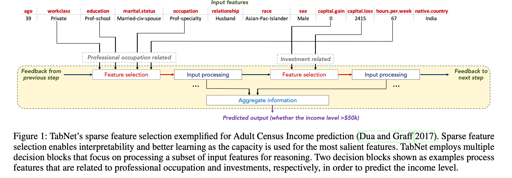
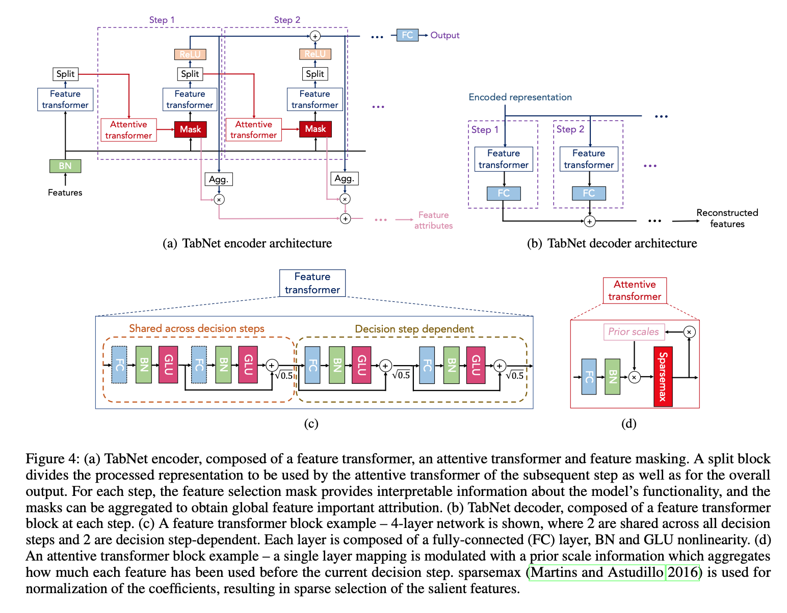
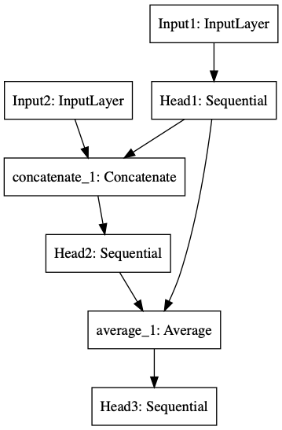

# Kaggle Mechanisms of Action Prediction - Solo Bronze Medal Solution
About this Competition: https://www.kaggle.com/c/lish-moa
## Methods
* Highly Unbalanced Data: The data is highly unbalanced, so for each base model, I set 7 different seeds and blend 7 different models to have a robust result.
* Normalization: RankGauss, a method which works usually much better than standard mean/std scaler or min/max. [Michael Jahrer](https://www.kaggle.com/mjahrer) introduced this method [here](https://www.kaggle.com/c/porto-seguro-safe-driver-prediction/discussion/44629).
* Dimension Reduction: PCA + Variance Threshold
* Models: I used TabNet, multi-heads-ResNet and simple fully connected neural network as base models, then blended the result of all three models as final submission. 

This is a multi-label task, and our labels are protein targets' mechanism of action responses, which is reasonable to have some correlation from each other, so I didn't used LightGBM model which can't explore this relationship.

TabNet outperforms or is on par with other tabular learning models on various datasets for classification and regression problems from different domains. It is a Tree-based learning that uses sequential attention to choose which features to reason from at each decision step.

Since the data for this competition has pretty much features, 870+ original features and 1500+ after feature engineering, TabNet seems to be very suitable for this data. The original Paper about TabNet can be found [here](https://arxiv.org/pdf/1908.07442.pdf). The basic structure of TabNet is: 

<p align="middle">
  
  
</p>

The model structure of multi-heads-ResNet is:

<p align="middle">
  
</p>

<p href="https://github.com/RuichongWang/Kaggle/blob/main/Mechanisms-of-Action-Prediction/img/Multi_head.png" align="middle">
  Structure in detail
</p>

## Data loading
1. Original competition data from kaggle
```
  mkdir input
  cd input
  kaggle competitions download -c liverpool-ion-switching
```
2. Data without drift
As discussed in [this passage](https://www.kaggle.com/c/liverpool-ion-switching/discussion/133874), the original data is synthetic data with real life "electrophysiological" noise and synthetic drift added. [Chris Deotte](https://www.kaggle.com/cdeotte) created [this Data Set](https://www.kaggle.com/cdeotte/data-without-drift) which removed the drift and presented a cleaned data.
```
  kaggle datasets download -d cdeotte/data-without-drift
```
3. RAPIDS
In rapids-knn-as-features.ipynb, I used RAPIDS-KNN to create additional features, so RAPIDS is needed before running it.
```
  kaggle datasets download -d cdeotte/rapids
```
4. Ion shifted rfc proba
Thanks to [Sergey Bryansky](https://www.kaggle.com/sggpls/competitions), [this data](https://www.kaggle.com/sggpls/ion-shifted-rfc-proba) is the forcasted probability of train and test data using random forest classifier. This can be used as extra features.
```
  kaggle datasets download -d sggpls/ion-shifted-rfc-proba
```
5. Kalman cleaned data
Thanks to [ragnar](https://www.kaggle.com/ragnar123), [this data](https://www.kaggle.com/ragnar123/clean-kalman) removed the noise in original signal.
```
  kaggle datasets download -d ragnar123/clean-kalman
```
