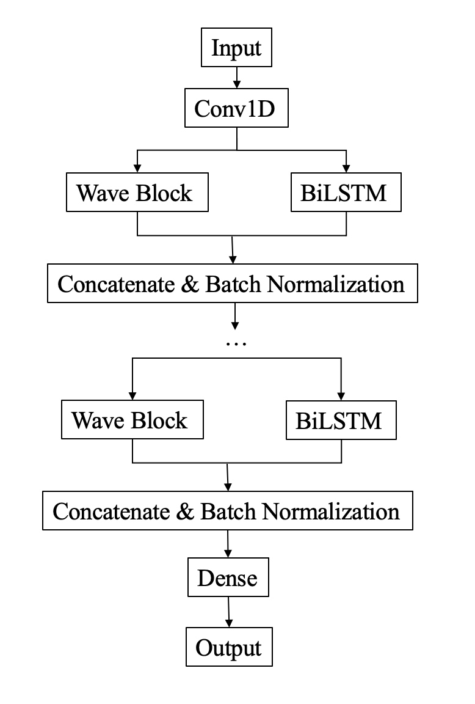
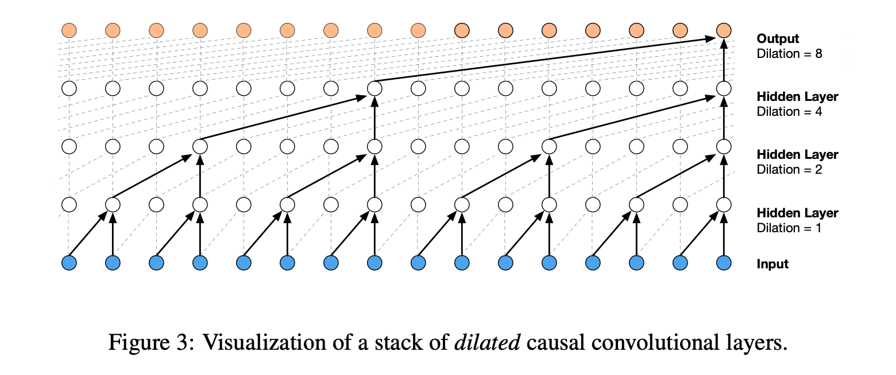
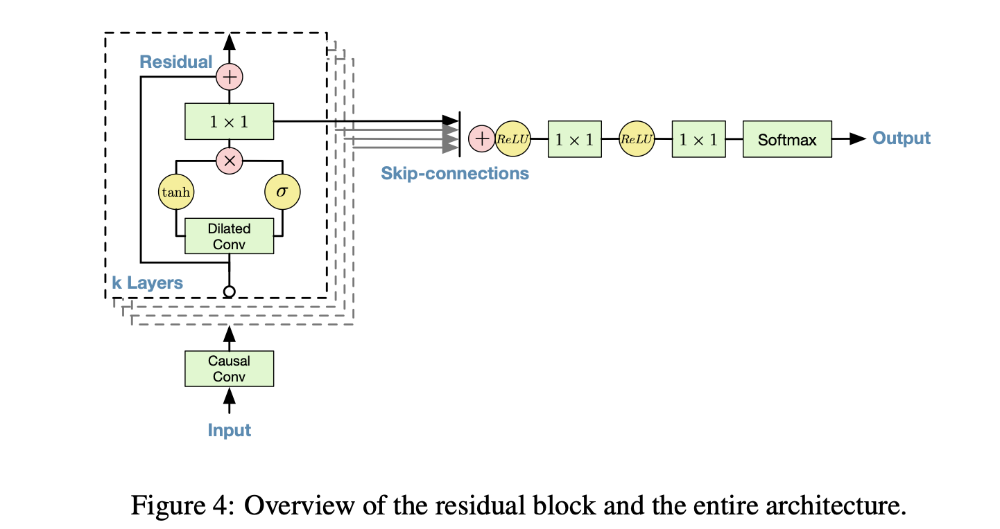

# Kaggle Ion Switching Prediction Competition - Solo Silver Medal Solution
About this Competition: https://www.kaggle.com/c/liverpool-ion-switching
## Repository contents
* rapids-knn-as-features.ipynb == predicted result of rapids-knn which can be used as extra features
* Ion-final.ipynb == final notebook for submission
## Methods
In this competition, I used a four-layer-model where each layer is a concatenated WaveNet-BiLSTM layer. The model structure is:

<p align="middle">
  
</p>

Since the data for this competition is high frequency data, sampled in 10 kHz, WaveNet, a generative model for raw audio, seems to be very suitable for this data. The original Paper about WaveNet can be found [here](https://arxiv.org/pdf/1609.03499.pdf). The basic structure of WaveNet is: 

<p align="middle">
  
  
</p>

## Data loading
1. Original competition data from kaggle
```
  mkdir input
  cd input
  kaggle competitions download -c liverpool-ion-switching
```
2. Data without drift
As discussed in [this passage](https://www.kaggle.com/c/liverpool-ion-switching/discussion/133874), the original data is synthetic data with real life "electrophysiological" noise and synthetic drift added. [Chris Deotte](https://www.kaggle.com/cdeotte) created [this Data Set](https://www.kaggle.com/cdeotte/data-without-drift) which removed the drift and presented a cleaned data.
```
  kaggle datasets download -d cdeotte/data-without-drift
```
3. RAPIDS
In rapids-knn-as-features.ipynb, I used RAPIDS-KNN to create additional features, so RAPIDS is needed before running it.
```
  kaggle datasets download -d cdeotte/rapids
```
4. Ion shifted rfc proba
Thanks to [Sergey Bryansky](https://www.kaggle.com/sggpls/competitions), [this data](https://www.kaggle.com/sggpls/ion-shifted-rfc-proba) is the forcasted probability of train and test data using random forest classifier. This can be used as extra features.
```
  kaggle datasets download -d sggpls/ion-shifted-rfc-proba
```
5. Kalman cleaned data
Thanks to [ragnar](https://www.kaggle.com/ragnar123), [this data](https://www.kaggle.com/ragnar123/clean-kalman) removed the noise in original signal.
```
  kaggle datasets download -d ragnar123/clean-kalman
```
